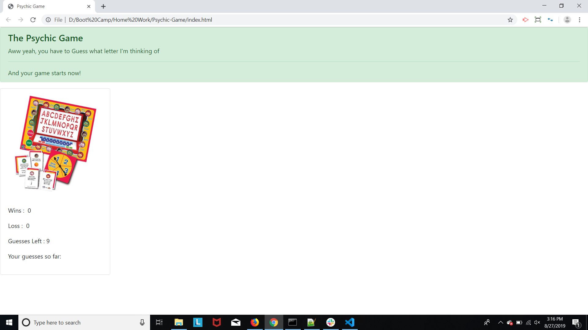

# Psychic Game

## Site pictures


## Technologies Used
- HTML : used to create elements on the DOM
- Bootstrap  : Styles html elements on page
- Javascript : used to provide interative effects
- Git : version control system to track changes to source code
- GitHub : hosts repository that can be deployed to GitHub pages

## Summary
### Built a game that guesses a character what computer thinks. Your guesses are compared with computer and if both matches, you win otherwise you lose! You have got 9 chances to guess correctly.

## Code Snippet
```Javascript

if(userGuess == computerGuess){
    wins  = wins + 1;
    populateWins(wins);
    reset();
    console.log("wins");
}
else if(guessLeft==1){
    losses = losses + 1;
    populateLosses(losses);
    reset();
}
else{
    guessLeft = guessLeft - 1;
    displayGuessLeft();
}
```


## Author Links
[LinkedIn](https://www.linkedin.com/in/mahisha-gunasekaran-0a780a88/)

[GitHub](https://github.com/Mahi-Mani)

